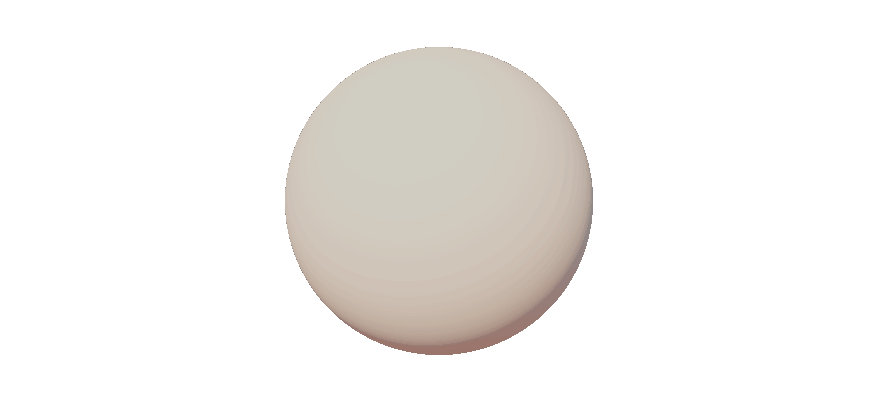

# mSDFRenderer
A set of plug-ins for **Autodesk Maya** that displays signed distance functions (implicit surfaces) in the viewport in real-time.



## Overview
This project is an experiment that evaluates the suitability of using signed distance functions (SDF) and ray marching within an 
animation pipeline in Autodesk Maya. Several applications are possible.

One potential use is during the animation stage. At this point in production, Maya scenes must remain highly performant. Because ray 
marching can be efficient, the idea is to convert existing background meshes into SDF and render them with ray marching to keep 
working scenes lightweight. Animated elements, such as characters and props, remain as polygonal meshes.

The goal of the plugin is to display SDF-defined surfaces in Maya’s viewport in real time. These SDF can be defined directly inside 
the shader or imported from a 3D grid that stores signed distances to a surface.

SDF provide an alternative to polygon meshes for representing 3D surfaces. Instead of vertices and faces, a surface is specified by a 
mathematical signed distance function, which can greatly reduce storage requirements. Ray marching is the rendering technique used to 
visualize these implicit surfaces.

-------------------------------------------------------------------------------

## Features
### Rendering SDF in Maya viewport

While Maya includes a “blobby surface” technology for working with metaballs, it ultimately converts them to polygonal meshes before 
rendering. This conversion negates the core benefits of SDF in terms of image quality and performance. This project aims to leverage 
the full advantages of SDF by rendering them directly via ray marching.

To display SDF in Maya’s viewport, we override the viewport pipeline using Maya’s `MRenderOverride` API.

To render SDF, we developed several shaders that generate SDF and display them using ray marching. The shaders use the OGSFX format, 
Maya’s shader format, which bundles both the vertex and pixel (fragment) shaders. In our case, we do not use a vertex shader because no 
geometry is required to produce SDF; the work is almost only done in the pixel shader. The shader code is similar to GLSL.

Each shader receives all relevant Maya camera attributes (position, rotation, FOV, etc.) as inputs to drive the ray marching render.

The shaders are designed to work with Maya’s default viewport renderer, so meshes and SDF can be displayed together in the same 
viewport.

### Converting a Mesh into an SDF

To render a mesh as an SDF, the first step is to convert the mesh into a 3D signed-distance grid. The grid fully encloses the mesh, 
and each cell stores the shortest distance to the surface. This can be done with the Python 
package [mesh2sdf](https://pypi.org/project/mesh2sdf/), which uses the fast sweeping algorithm.

Using our `gen_sdf.py` script, which takes any OBJ mesh as input, you can generate this 3D grid. To make it easy for our shaders to 
use, the 3D grid is flattened into a 2D texture (.png). Each pixel in the texture corresponds to the signed distance of a grid 
cell, encoded in grayscale.

-------------------------------------------------------------------------------

## Developer Quick Start

To quickly display SDF without converting any mesh:

- Open the `sdf_renderer.py` script and set the `SHADER_PATH` variable to one of 
the demo shaders you want to display :

| Shader | Description |
| ------ | ------ |
|`rmchSphere.ogsfx`|Simple demo shader that generates two implicit spheres and blends them with a smooth minimum. You can play an animation of the spheres fusing using the Maya Timeline. The spheres are rendered with ray marching.|
|`infiniteSphere.ogsfx`|Demo shader that instantiates spheres infinitely using domain repetition. The spheres are rendered with ray marching.|
|`limiteSphere.ogsfx`|Demo shader that instantiates spheres within a finite region using domain repetition. The spheres are rendered with ray marching.|

- Then load the `sdf_renderer.py` plug-in using Maya’s Plug-in Manager.


- Next, in Maya’s viewport settings, under Renderer, select **SDF Renderer** to use the overridden version with the shader referenced 
earlier.

To modify the appearance of SDF (Lambert, Realistic, etc.): 

- Load the `sdf_setting_node.py` plug-in.  
- With this plug-in you can creates a node of type SDFSettingNode which, through the editor attribute, lets you adjust shader parameters in real time.  

Alternatively, it can be done with the following code:
```python
import maya.cmds as mc

mc.loadPlugin( '.../src/sdf_renderer.py' )
mc.loadPlugin( '.../src/sdf_setting_node.py' )

mc.createNode('SDFSettingNode')
```

To display meshes converted into a signed distance field:
- In the `sdf_renderer.py` script, initialize the `SHADER_PATH` variable with one of the shaders you want to use to render the surface:

| Shader | Description |
| ------ | ------ |
|`implicitGrid.ogsfx`|Final step in converting a mesh to an SDF. Shader that displays an implicit surface from a 3D signed distance field grid using ray marching. This shader generates a sphere for each grid cell where the value is negative. **WARNING**: This shader generates a very large number of SDF primitives (without using a repetition domain), which can dramatically slow down your computer.|
|`implicitGridRender.ogsfx`|Final step in converting a mesh to an SDF. Shader that displays an implicit surface from a 3D signed distance field grid using ray marching. This shader does not generate spheres; the ray marching operates directly on the grid.|
|`limiteSphereGrid.ogsfx`|Final step in converting a mesh to an SDF. WIP shader that displays an implicit surface from a 3D signed distance field grid. This shader uses a repetition domain to instantiate a sphere for each grid cell. The sphere’s radius depends on the grid value: if the value is negative, the radius is positive; if the value is positive, the radius is null.|

⚠️ **These shaders do not work without a grid**. To generate a signed distance field grid, use the `gen_sdf.py` script with the following command:
```
python src\gen_sdf.py src\data\stanford-bunny.obj src\data\stanford-bunny-grid.png 20 0.8
```

This command generates a grid as a 2D image, which you must reference in the `sdf_renderer.py` script via the `GRID_PATH` variable.

- A Maya restart is sometimes required.

## License
This project is licensed under the MIT License.

## Contributing
All contributions are welcome. Please refer to the contribution guidelines for details on how to contribute.

## Credits
The Stanford Bunny model is included for testing purposes only and remains the property 
of the [Stanford Computer Graphics Laboratory](https://graphics.stanford.edu/data/3Dscanrep/).
